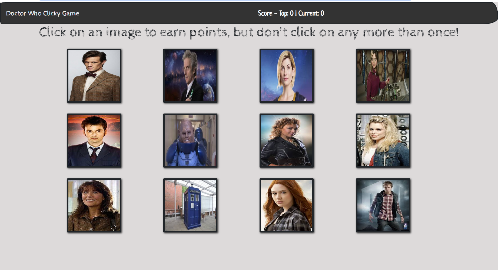

 # Clicky Game - Doctor Who Style!
 
 For this assignment, I created a memory game with React. This assignment will required me to break up your application's UI into components, manage component state, and respond to user events. 

## Game Objectives

Click the pictures and they will move randomly about the board. If you click the same picture twice, you lose! The game will keep track of your highest score and reset once one picture is clicked twice.

## Play the Game!

https://tiffnlewis.github.io/Clicky-Game/

## Screenshots

